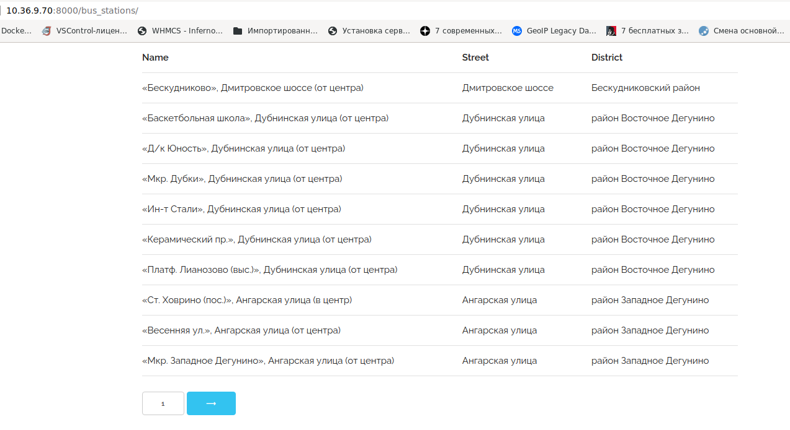
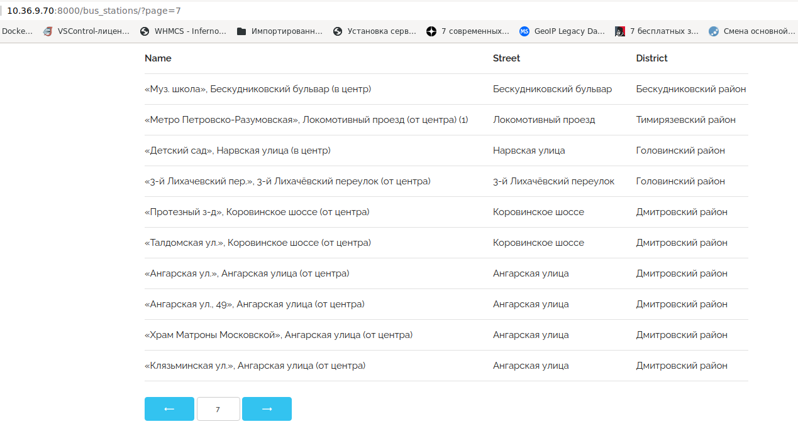

# Обработка запросов и шаблоны

Необходимо выполнить и предоставить на проверку следующие задачи:

1. [Рецепты](./recipes)

## Дополнительные задания:

1. [Пагинация](./pagination)


# Решение  

1. Рецепты

В структуру данных, описывающую рецепты, добавлен собственный рецепт хот-дога:  
```
'hotdog': {
        'булочка для хот-дога, шт': 1,
        'сосиска, штука': 1,
        'кетчуп, г': 20,
        'горчица, г': 10,
    }
```

В файл маршрутов  [urls.py](./recipes/recipes/urls.py) добавлены маршруты для отображения отдельных рецептов и вывода страницы со списком рецептов ( home_view ):  
```
from calculator.views import home_view, omlet_view, pasta_view, buter_view, hotdog_view

urlpatterns = [
    # здесь зарегистрируйте вашу view-функцию
    path("", home_view, name='home'),
    path('omlet/', omlet_view, name='omlet'),
    path('pasta/', pasta_view, name='pasta'),
    path('buter/', buter_view, name='buter'),
    path('hotdog/', hotdog_view, name='hotdog'),

```

В файл маршрутов  [views.py](./recipes/calculator/views.py) добавлены функции-обработчики для формирования списка ингредиентов для каждлго рецепта.  
По умолчанию расчёт количества ингрудиентов производится для одной порции,  для отображения ингредиентов для N-ого количества порция используется опциональный параметр *servings*. 

Добавлен шаблон home.html для вывода списка рецептов.  

## Скриншоты  

Вывод списка рецептов:  
  
  
Вывод списка ингредиентов для одной порции:  
  
  
Вывод списка ингредиентов для пяти порций:  


2. Пагинация  

Решение сводится к загрузке данных из CSV-файла в структуру Python и написанию обработчика для пагинации в файле [views.py](./pagination/stations/[views.py])  

Результат работы:  

Первая страница:  
  
  
Седьмая страница:  
  
