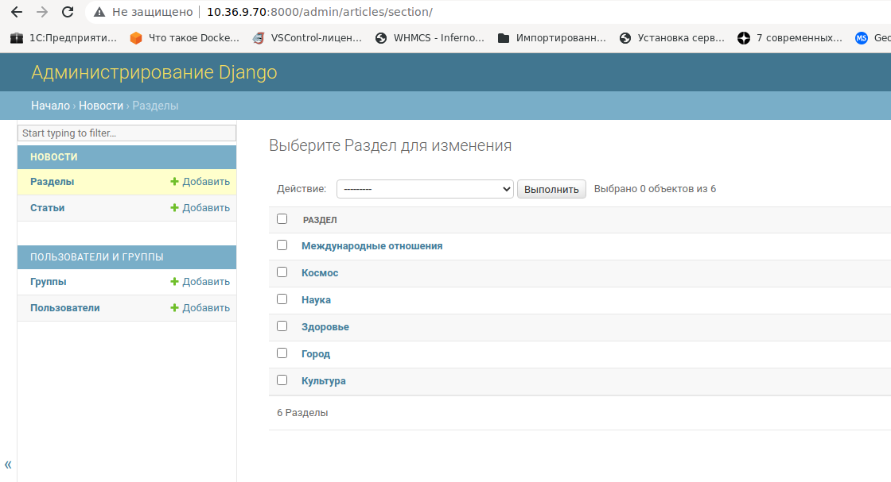
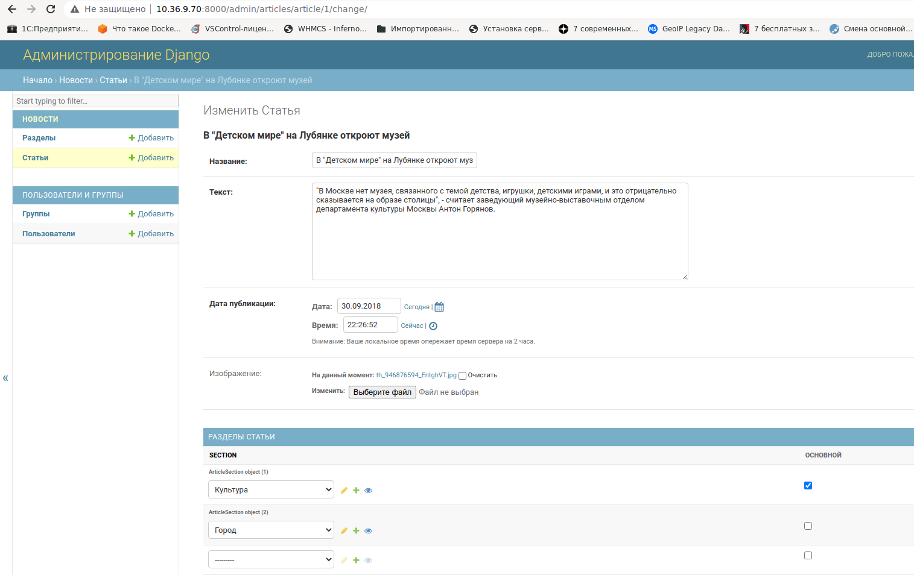
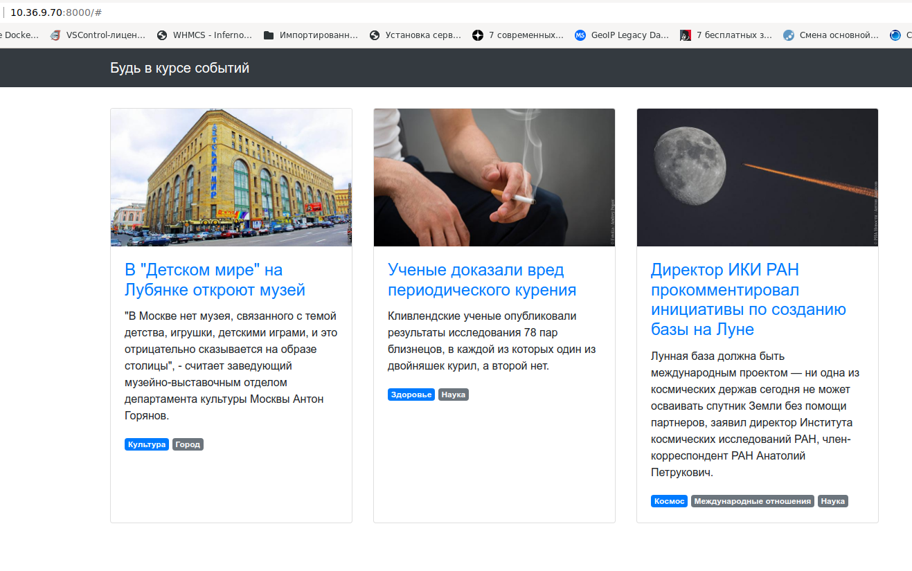

## Задание

Есть небольшой новостной сайт.

Было решено к статьям добавить тематические резделы, к которым они относятся, и отображать их у каждой новости в виде списка тегов.

У каждой статьи может быть несколько разделов, но всегда один из них должен быть основным.
В списке тегов он должен идти первым, потом все остальные в алфавитном порядке.

В админке необходимо реализовать создание разделов
и для страницы _Редактирование статьи_ добавить возможность указывать разделы.
Необходимо так же реализовать проверку на наличие одного и только одного основного раздела.

## Решение:  

Провожу первоначальную миграцию и загружаю данные:  

```python
python3 manage.py migrate
python3 manage.py loaddata articles.json
```

Изменяю модель даннных в файле [models.py](articles/models.py).

Создаю пользователя, провожу новую миграцию:

```python
python3 manage.py createsuperuser
python3 manage.py makemigrations
python3 manage.py migrate

```

В админке заполняю разделы:  
  
  


И привязываю к статьям разделы:  
  
  


Корректирую обработчик [views.py](articles/views.py). 
  
Итоговая страница:  
  
  