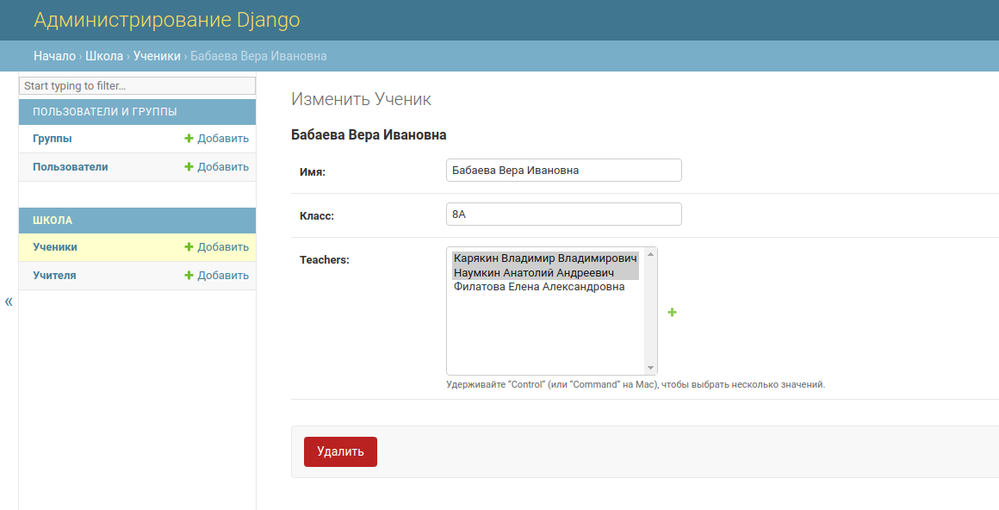
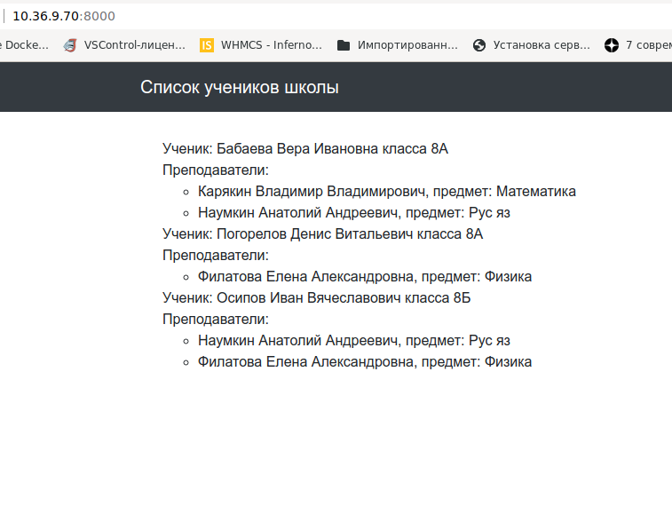

# Миграции

## Задание

Есть страница сайта школы.
При создании был не верно выбран тип связи `многие к одному`.
И теперь у ученика есть только один учитель и чтобы добавить к нему второго, требуется
заново добавлять ученика в базу.

Необходимо поменять модели и сделать отношение `многие ко многим` между Учителями и Учащимися.
Это решит проблемы текущей архитектуры.

Задача:

1. Поменять отношения моделей `Student` и `Teacher` с `Foreign key` на `Many to many`
2. Поправить шаблон списка учеников с учетом изменения моделей


## Решение

1. Провожу миграцию:  
  
```bash
python manage.py migrate
```

В результате получаю таблицы в БД:  
```
netology_orm_migrations=# \dt
                     Список отношений
 Схема  |            Имя             |   Тип   | Владелец 
--------+----------------------------+---------+----------
 public | auth_group                 | таблица | postgres
 public | auth_group_permissions     | таблица | postgres
 public | auth_permission            | таблица | postgres
 public | auth_user                  | таблица | postgres
 public | auth_user_groups           | таблица | postgres
 public | auth_user_user_permissions | таблица | postgres
 public | django_admin_log           | таблица | postgres
 public | django_content_type        | таблица | postgres
 public | django_migrations          | таблица | postgres
 public | django_session             | таблица | postgres
 public | school_student             | таблица | postgres
 public | school_teacher             | таблица | postgres
(12 строк)

```

2. Загружаю данные:  
  
```bash
python manage.py loaddata school.json
```
  
Содержимое таблиц после загрузки данных:  
  

```
netology_orm_migrations=# SELECT * FROM school_student;
 id |            name            | group | teacher_id 
----+----------------------------+-------+------------
  1 | Бабаева Вера Ивановна      | 8А    |          1
  2 | Погорелов Денис Витальевич | 8А    |          3
  3 | Осипов Иван Вячеславович   | 8Б    |          3
(3 строки)

netology_orm_migrations=# SELECT * FROM school_teacher;
 id |             name              |  subject   
----+-------------------------------+------------
  1 | Карякин Владимир Владимирович | Математика
  2 | Наумкин Анатолий Андреевич    | Рус яз
  3 | Филатова Елена Александровна  | Физика
(3 строки)

```

3. Изменяю отношение в модели данных на "many-to-many":  
```
class Student(models.Model):
    name = models.CharField(max_length=30, verbose_name='Имя')
#    teacher = models.ForeignKey(Teacher, on_delete=models.CASCADE)
    group = models.CharField(max_length=10, verbose_name='Класс')
    teachers = models.ManyToManyField(Teacher, related_name='students')

    class Meta:
        verbose_name = 'Ученик'
        verbose_name_plural = 'Ученики'

    def __str__(self):
        return self.name
```

Создаю новую миграцию:  
```bash
$ python3 manage.py makemigrations
```
И выполняю миграцию:  
```bash
$ python3 manage.py migrate
```

В результате изменяется структура базы данных - добавилась таблица `school_student_teachers`:  
```
netology_orm_migrations=# \dt
                     Список отношений
 Схема  |            Имя             |   Тип   | Владелец 
--------+----------------------------+---------+----------
 public | auth_group                 | таблица | postgres
 public | auth_group_permissions     | таблица | postgres
 public | auth_permission            | таблица | postgres
 public | auth_user                  | таблица | postgres
 public | auth_user_groups           | таблица | postgres
 public | auth_user_user_permissions | таблица | postgres
 public | django_admin_log           | таблица | postgres
 public | django_content_type        | таблица | postgres
 public | django_migrations          | таблица | postgres
 public | django_session             | таблица | postgres
 public | school_student             | таблица | postgres
 public | school_student_teachers    | таблица | postgres
 public | school_teacher             | таблица | postgres
(13 строк)
```

Изменилась структура таблицы `school_student` - удалилось поле `teacher_id `:  
```
netology_orm_migrations=# SELECT * FROM school_student;
 id |            name            | group 
----+----------------------------+-------
  1 | Бабаева Вера Ивановна      | 8А
  2 | Погорелов Денис Витальевич | 8А
  3 | Осипов Иван Вячеславович   | 8Б
(3 строки)

```

Сопоставление учеников и учитилей произвожу через админку Django:  


В [views.py](school/views.py) корректирую класс students_list.  


Результат работы - список учеников с учителями:  


