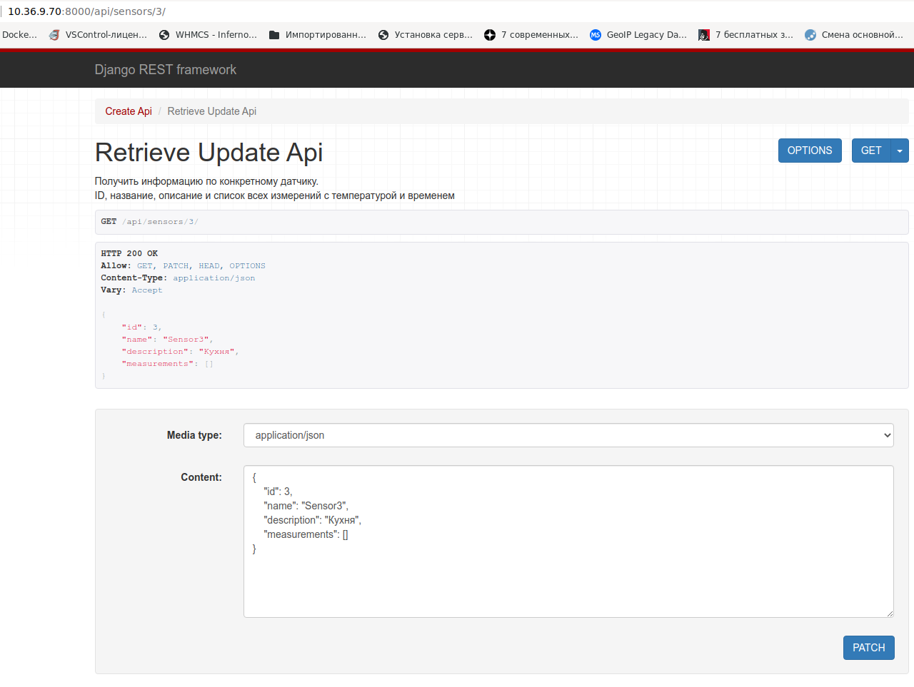
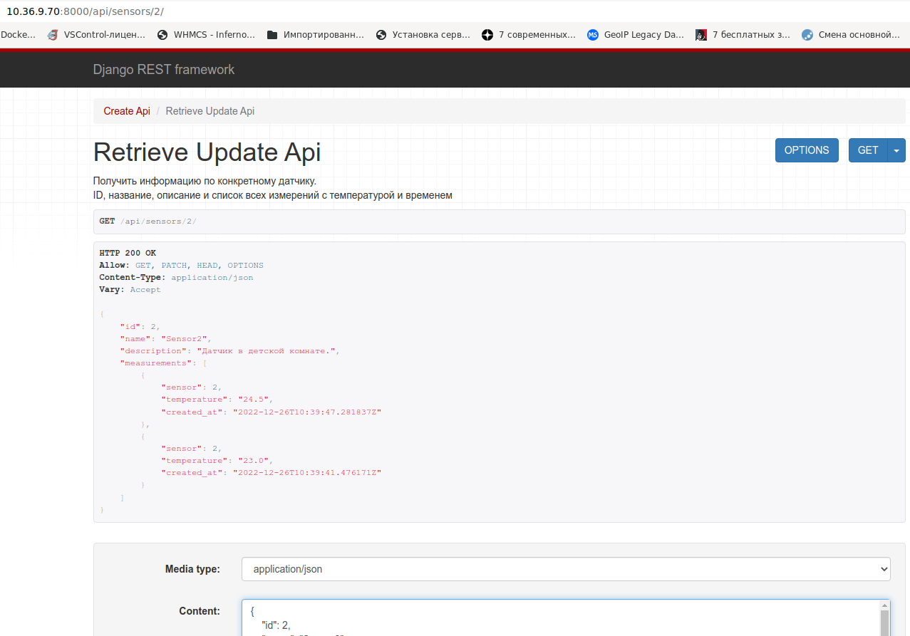

# Умный дом

## Техническая задача: реализовать некоторые действия из CRUD, используя Django Rest Framework.

**CRUD** – аббревиатура для Create-Read-Update-Delete. Ей обозначают логику для операций создания-чтения-обновления-удаления сущностей. Подробнее: https://ru.wikipedia.org/wiki/CRUD

## Описание

У нас есть программируемые датчики, измеряющие температуру. Раз в некоторый интервал времени датчики делают запрос по API и записывают свои показания. В показания датчики передают свой ID и текущую температуру в градусах Цельсия.

Необходимо реализовать REST API для добавления/изменения датчиков, их просмотра и добавления новых измерений температуры.

Требуется задать 2 модели (они уже описаны в models.py):

- датчик:

  - название
  - описание (необязательное, например, "спальня" или "корридор на 2 этаже")

- измерение температуры:

  - ID датчика
  - температура при измерении
  - дата измерения

Для сериализаторов используйте `ModelSerializer`.

---

## Решение.

Запросы, которые должны быть реализованы в системе:

1. Создать датчик. Указываются название и описание датчика.

2. Изменить датчик. Указываются название и/или описание.

3. Добавить измерение. Указываются ID датчика и температура.

4. Получить список датчиков. Выдается список с краткой информацией по датчикам: ID, название и описание.

5. Получить информацию по конкретному датчику. Выдается полная информация по датчику: ID, название, описание и список всех измерений с температурой и временем.

