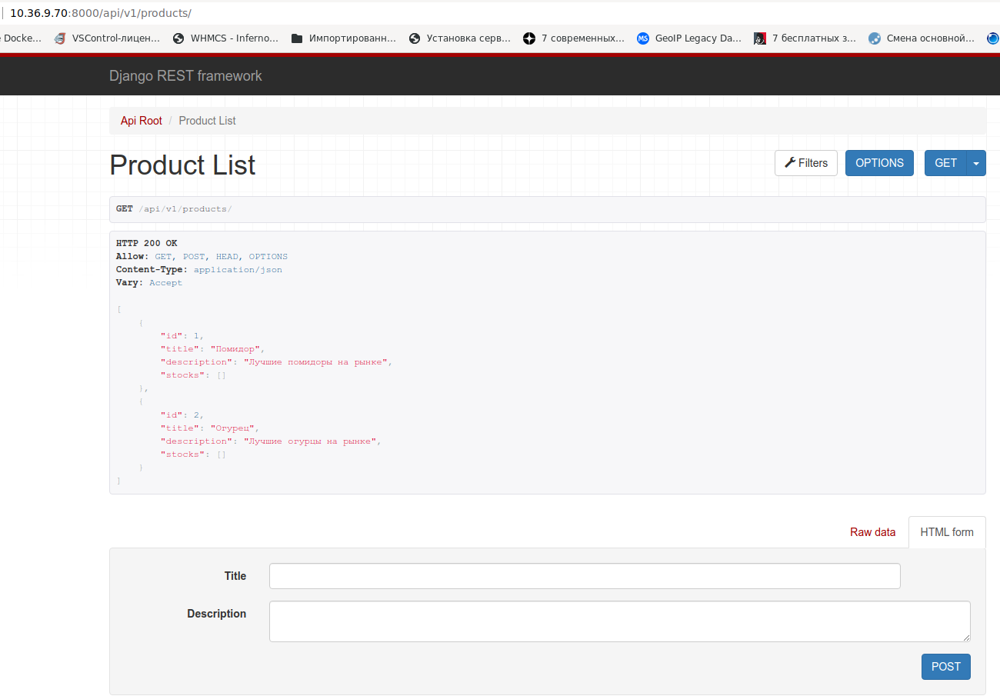
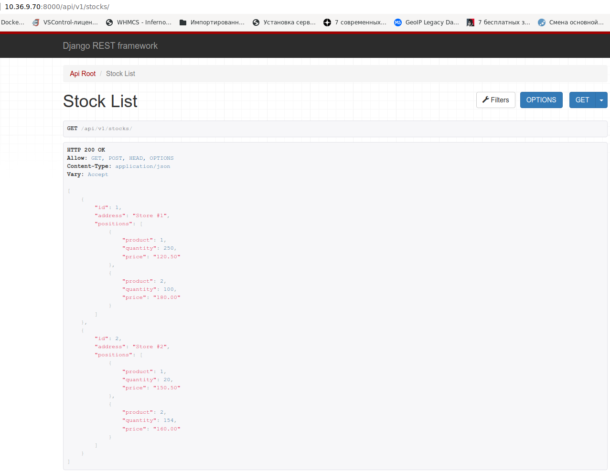

# Склады и товары

## Техническая задача: реализовать CRUD-логику для продуктов и складов, используя Django Rest Framework.

**CRUD** – аббревиатура для Create-Read-Update-Delete. Ей обозначают логику для операций создания-чтения-обновления-удаления сущностей. Подробнее: https://ru.wikipedia.org/wiki/CRUD

## Описание

У нас есть продукты, которыми торгует компания. Продукты описываются названием и необязательным описанием (см. `models.py`). Также компания имеет ряд складов, на которых эти продукты хранятся. У продукта на складе есть стоимость хранения, поэтому один и тот же продукт может иметь разные стоимости на разных складах.

Необходимо реализовать REST API для создания/получения/обновления/удаления продуктов и складов. Так как склады имеют информацию о своих продуктах (через связанную таблицу) - необходимо переопределить методы создания и обновления объектов в сериализаторе (см. `serializers.py`).

Помимо CRUD-операций необходимо реализовать поиск продуктов по названиям и описанию. И поиск складов, в которых есть определенный продукт (по идентификатору). Подробности в файле `requests-examples.http`.

Так как продуктов и складов может быть много, то необходимо реализовать пагинацию для вывода списков.

Рекомендуется обратить внимание на реализацию файлов `urls.py` (менять их не надо, просто обратить внимание и осознать).

## Подсказки

1. Вам необходимо будет задать логику во views и serializers. В места, где нужно добавлять код, включены комментарии. После того как вы добавите код, комментарии можно удалить.

2. Для обновления объектов удобно использовать метод `update_or_create`: https://docs.djangoproject.com/en/3.2/ref/models/querysets/#update-or-create


## Решение  

Создаю рабочее окружение:  
```bash
  python3 -m venv ./stocks_products/
  source ./stocks_products/bin/activate
  cd ./stocks_products/
```

Устанавливаю зависимости:  
```bash
pip3 install -r requirements.txt
python3 -m pip install Pillow
pip3 install django-filter
```

Создаю БД в PostgreSQL:  
```
# CREATE DATABASE netology_stocks_products;
CREATE DATABASE
```

Выполняю миграцию:  
```
python3 manage.py migrate
```

Запускаю сервер:  
```
python3 manage.py runserver 0.0.0.0:8000
```


Вношу изменения в файлы [serializers.py](./logistic/serializers.py) и [views.py](./logistic/views.py)  

Результат работы:  

Список товаров:  


  
Список складов с товарами:  




