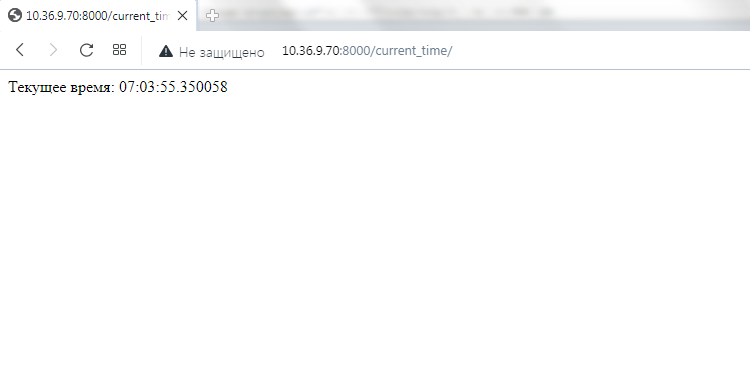
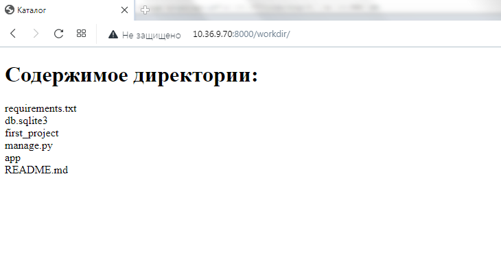

# Работа с проектом и приложением

## Задание

Вам дана заготовка с Django проектом. В проект уже добавлено 1 приложение – `app`.

Вам необходимо реализовать 3 view функции и настроить для них правильные урлы.

- `/` - домашняя страница, содержит список доступных страниц;
- `current_time/` - показывает текущее время в любом удобном вам формате;
- `workdir/` – выводит содержимое [рабочей директории](https://ru.wikipedia.org/wiki/%D0%A0%D0%B0%D0%B1%D0%BE%D1%87%D0%B8%D0%B9_%D0%BA%D0%B0%D1%82%D0%B0%D0%BB%D0%BE%D0%B3).

В первую очередь обратите внимание на файл [urls.py](./first_project/urls.py). В нем задаются пути ко view-функциям, которые отвечают по соответствующим запросам.

Приложение `app` уже добавлено в проект и включено в `INSTALLED_APPS` (обязательно убедитесь в этом, проверив файл с настройками).

`home_view` использует шаблон для генерации контента страницы. Шаблоны мы еще не изучали, это материал дальнейших лекций. Поэтому ориентируйтесь на подсказки, часть кода уже написано, вам нужно вписать недостающее 🙂.

Вам нужно вписать свой код в следующие файлы:

- [urls.py](./first_project/urls.py)
- [views.py](./app/views.py)


## Решение

Для отображения страниц внесены изменения в файл [urls.py](./first_project/urls.py):  

Добавляю импорт _*time_view*_ и _*workdir_view*_:  
```
from app.views import time_view
from app.views import workdir_view
```

Добавляю пути, для обработки URLs _*current_time*_ и _*workdir*_:  
```
path('current_time/', time_view, name='time'),
path('workdir/', workdir_view, name='workdir'),
```

В файл [views.py](./app/views.py) добавляю функционал для вычисления текущего времени и вывода рабочей директории:  

Импортирую необходимые модули:  
```
import datetime
import os
```

Корректирую функции для реализации заданного функционала:  

```
def time_view(request):
    # обратите внимание – здесь HTML шаблона нет, 
    # возвращается просто текст
    current_time = datetime.datetime.now().time()
    msg = f'Текущее время: {current_time}'
    return HttpResponse(msg)


def workdir_view(request):
    template_name = 'app/listdir.html'
    # по аналогии с `time_view`, напишите код,
    # который возвращает список файлов в рабочей 
    # директории
    list_dir = os.listdir()
    context = {
        'list_dir': list_dir
    }
    return render(request, template_name, context)
```

Для более "красивого" вывода содержимого рабочей директории создаю шаблон _*listdir.html*_:  
```
<!DOCTYPE html>
<html lang="en">
<head>
    <meta charset="UTF-8">
    <title>Каталог</title>
</head>
<body>
    <h1>Содержимое директории:</h1>
    
        {{ file_name }}
        <br>
    
</body>
</html>
```

###Скриншоты

Текущее время:  



Содержимое директории:  

